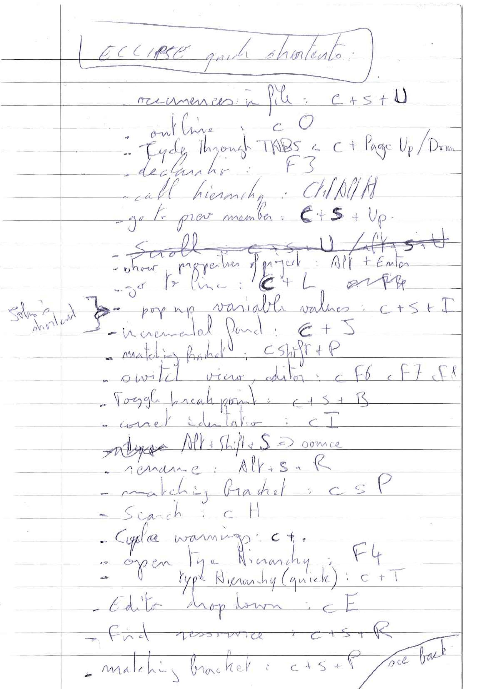
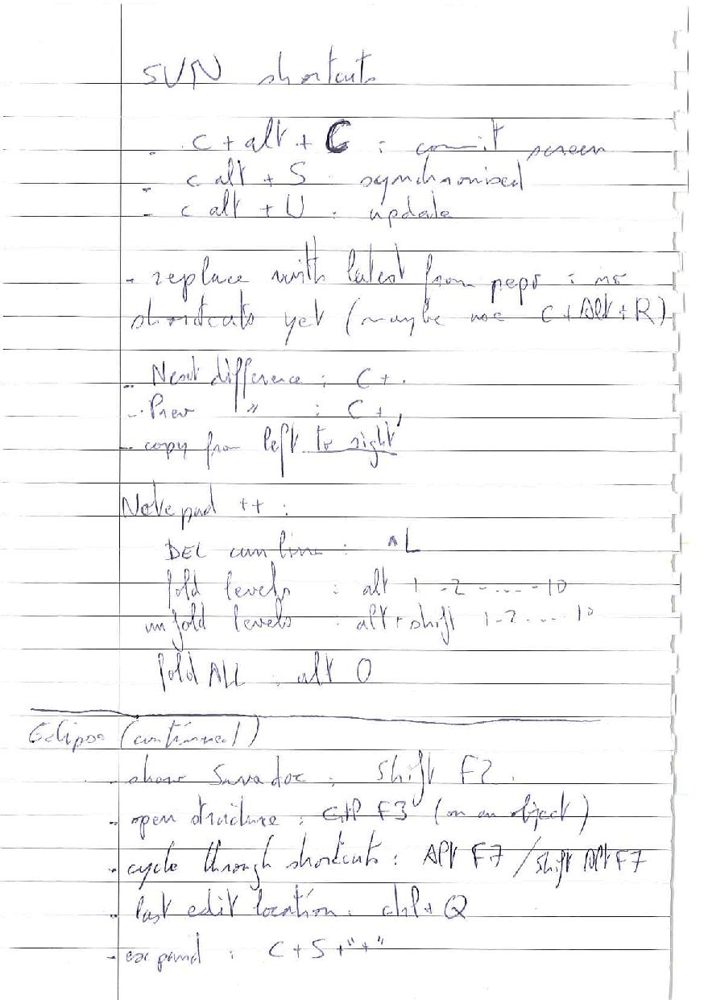
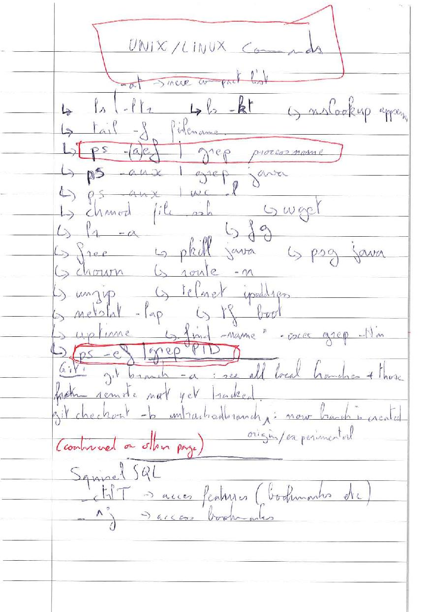
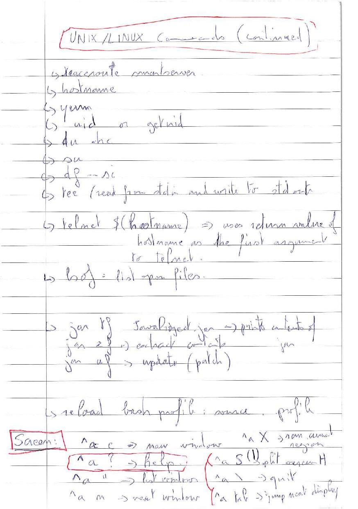
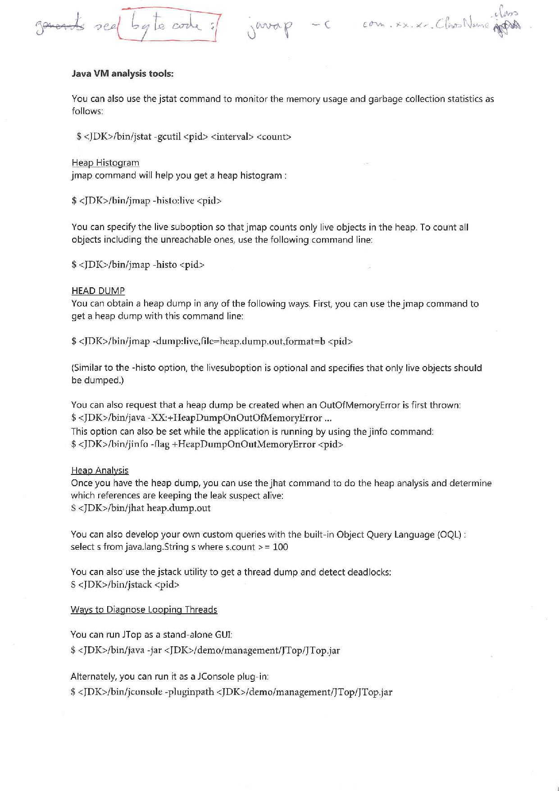

# IntelliJ IDEA

Below are the shortcuts I use the most useful in IntelliJ.  

Note I marked the shortcuts that I remapped with the <b>**</b> symbol and added the original shortcut in bracket (if applicable).

For more shortcuts you can also check <a href="http://www.jetbrains.com/idea/webhelp/keyboard-shortcuts-you-cannot-miss.html" target="_blank">this article</a> from Intellij.

## Mac

<pre>
Shortcut                        Action                                    
-----------------------------------------------------------------------------------------------------
⌥ ⌘ B                           navigate to subtypes
⌥ Up                            select expanding
⌥ ⌘ V                           extract variable
⌘ /                             (un)comment lines
⌥ ⌘ /                           (un)comment block
Tab                             Live Templates
⌘ P                             brings method parameters
Up ⌘ Left                       last edit location
Up ⌘ F7                         highlight usages in the file
⌘ G / Up ⌘ G                    navigate through highlighted usages
Esc                             remove usages
^ Up Q                          shows declaration of current method   
⌘ E                             view recent files
⌥ ⌘ Up / Down                   jump between compiler errors or search results
⌘ J                             completion for live templates
^ Tab                           cycle through panels
⌘ } or {                        move to next / previous tab
Up ⌘ V                          insert recent clipboard content
^ H                             inheritance hierarchy for a selected class
⌥ F8                            evaluate expression (debug mode)
⌘ ,                             project & IDE settings
⌘ ;                             project structure
F1                              Quick Documentation
⌥ Space                         Quick definition (of class / method etc.)
⌘ P                             View | Parameter Info
⌘ B                             Navigate | Declaration
⌘ `                             Cycle between windows
⌥ ⌘ O                           open any particular method or field in the editor quickly
⌥ R                             Replace
Shift Shift                     Search everywhere
Up ⌘ Enter                      to complete a current statement such as if, do-while, try-catch
⌘ K                             commit directory popup
⌘ Up K                          git push
⌘ ^ O (**)                      reveal in Finder

</pre>

## Windows

<pre>

Shortcut                        Action                          
-----------------------------------------------------------------------------------------------------
^ Q                             quick doc
^ B                             navigate declaration
^ Alt B                         go to implementation    
^ F12                           file structure
Shift F6                        refactor | rename
^ O                             override method
^ I                             implement method
^ Shift Space                   SmartType code completion
Shift Shift                     Search everywhere
^ Shift F                       Find in path (same as normal find but searches all source files
^ Shift A                       Find actions e.g. settings, their shortcut if exists
^ E                             Recently opened file
F2                              Any error in file
^ Alt O                         Organize imports
Alt insert                      generate getter/setter
^ Alt I                         Format code

</pre>

# Eclipse IDE

## Windows

I am attaching below the scanned copy of my eclipse shortcuts.  No plans to rewrite them to markdown for now.

## UNIX

And here my UNIX ones (planning to rewrite to soon)

## JVM Analysis tool

I compiled this from various sources

